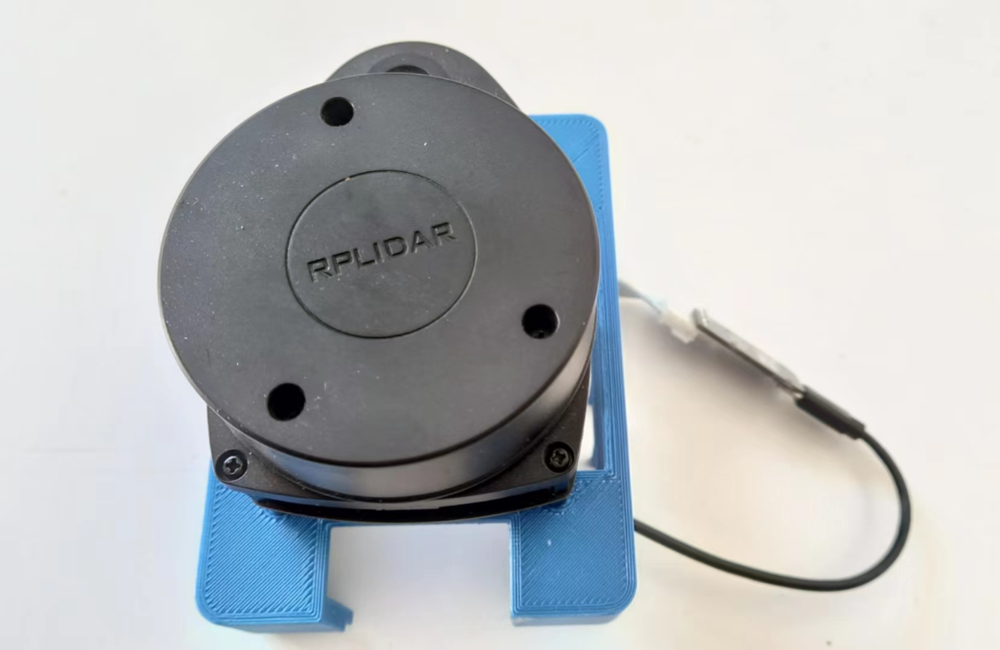
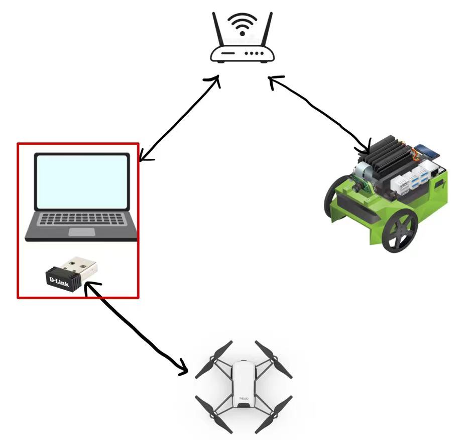
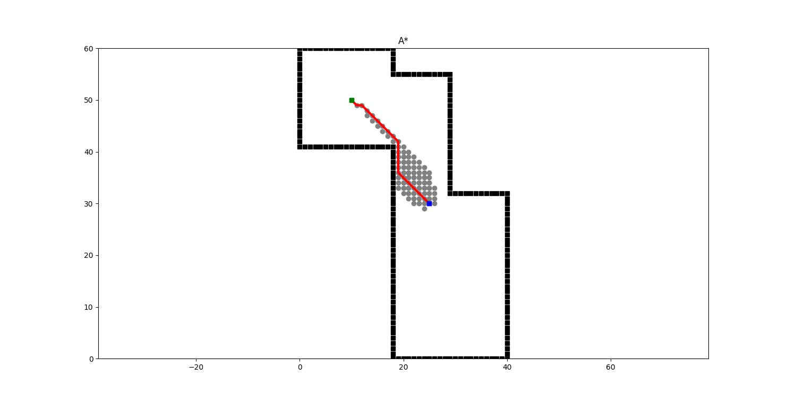

# Open Project For RAS Course In Turku University


## How they work

1. Use the jetbot move and run SLAM algorithm to make a map. After the jetbot find the target point, run a path plan algorithm for Tello
2. Fly the Tello according to the path.
3. Once the Tello arrive at the same target point, let the Jetbot rotate.

## The system

* Platforms: one Jetbot, one Tello, one laptop with Ubuntu
* Extra Sensor: we put a rplidar on jetbot



* An USB network card


* Communication: ROS2
  

### How Jetbot and Tello communicate
First, make Jetbot and laptop, connect to the WIFI of your room's router. Then, plug the extra USB network card to your laptop. And use this USB network card connect to the Tello's WIFI. Now, we can use the computer to process the data, and also, we make the computer as a bridge to let Jetbot and Tello communicate.



## How to run our code
---
### Prerequisites
We use some packages from Perception course, so make sure you already installed all packages from exercises of Perception course. Especially these three ones:
1. https://github.com/TIERS/turtlebot3_simulations/tree/foxy-devel 
2. Install the cartographer_ros on your computer, open a terminal and input:
```
$ sudo apt update
$ sudo apt install ros-foxy-cartographer-ros
```
Then, download the occupancy_grid.launch.py, gazebo_cartographer.launch.py and rosbag_cartographer.launch.py from Moodle and put it into：<br />
~/turtlebot3_ws/src/turtlebot3/turtlebot3_cartographer/launch/ folder

Go to ~/turtlebot3_ws/src/turtlebot3/turtlebot3_cartographer/config folder, and open turtlebot3_lds_2d.lua with an editor you like.Set the tracking_frame to “laser_frame”, and use_odometry to false.

Then open a terminal, rebuild the package.
```
$ cd ~/turtlebot3_ws
$ colcon build
$ source install/setup.bash
```
3. https://github.com/tentone/tello-ros2


---

### Run code
1. To run the rplidar on Jetbot, you need open the jetbot. And open a  terminal on computer, then:
```
$ ssh <your jetbot's ip>@jetbot
$ export ROS_DOMAIN_ID=1
$ sudo chmod 666 /dev/ttyUSB0
$ source ~/rplidar_ros2/install/setup.bash
$ ros2 run rplidar_ros rplidarNode
```

2. Use the rplidar data to run SLAM on your computer
```
$ export ROS_DOMAIN_ID=1
$ tbotsim
$ cd ~/turtlebot3_ws/src/turtlebot3/turtlebot3_cartographer/launch/
$ ros2 launch rosbag_cartographer.launch.py
```


3. Let the Jetbot move and avoid obstacles, automatically, to make a complete map in our apartment:
Run this ipynb file on jetbot.
<br />
https://github.com/NVIDIA-AI-IOT/jetbot/blob/master/notebooks/collision_avoidance/live_demo.ipynb


     #### This is the map of our apartment. 

.png)

4. Now we have a good map. We need to run a path planning algorithm. The website below offered a lot of path planning algorithms. <br />
https://github.com/zhm-real/PathPlanning
<br />We mainly chose A* algorithm.<br />This is the path we got.



5. Run our Jetbot's python file . Open a new terminal
```
$ ssh <your jetbot's ip>@jetbot
$ export ROS_DOMAIN_ID=1
$ python3 jetbot_listener.py
```
6. Then, we have two ways to control the Tello fly according to the path. NB! Inside these two python codes, for communicating with Jetbot--this part, they both use ros2.
   1. Use tello_ros2 package, we have to run this tello_ros2 package first, then we can control the tello in ROS2. Open a new terminal:
        ```
        $ cd /home/jimmy/tello-ros2-main/workspace
        $ . install/setup.bash
        $ cd src
        $ ros2 launch launch.py
        ```
        Run our tello's python file. Open a new terminal
        ```
        $ python3 tello_control1.py
        ```

   2. Or we can use djitellopy package. Open a new terminal. Run our tello's python file.
        ```
        $ python3 tello_control2.py
        ```


## Some reflection
- Because of the dim light in the room, tello perferoms bad in flight stability. So we have simplfied the path tello follwed shown in the video.
- The Jetbot Nvigation2 packages integrates automatic cruise and adaptive path planning. Since the electronical machinery of the jetbot we use is not stable, we just send tello to reach the goal position.